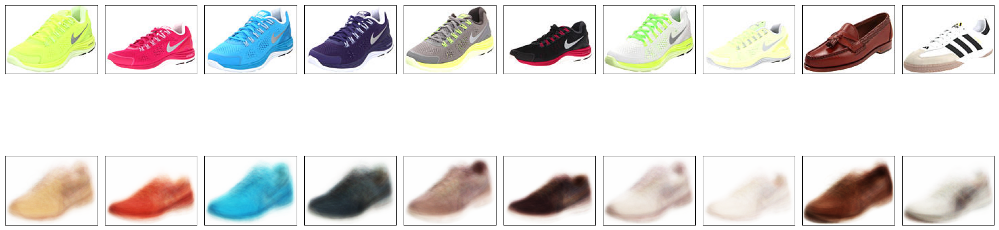

# Variational Autoencoder (VAE)

A simple implementation of a **Variational Autoencoder (VAE)** using TensorFlow/Keras, developed for a Deep Learning Qualification project. The notebook demonstrates unsupervised image reconstruction by learning a compact latent representation.

---

## Overview

The model encodes images into a latent space and reconstructs them through a decoder network. The training objective combines **reconstruction loss** (binary cross-entropy) and **KL divergence**, allowing the model to learn meaningful latent features.

---

## Tech Stack


---

## Results

Below is an example of the reconstruction output after training:

**Original vs Reconstruction**



The VAE successfully captures global structure and color distribution, though fine-grained details (e.g., texture and edges) remain blurred.

---

## Repository Structure

```
vae-image-reconstruction/
├── VAE_model.ipynb
├── results/
│   └── reconstruction.png
├── README.md
└── LICENSE
```

---

## Future Work

* Increase latent dimension for more expressive features.
* Explore convolutional layers (Conv-VAE) for better reconstruction quality.
* Add perceptual loss or VAE-GAN variant for sharper results.

---

## License

MIT License © 2025 Jeremy Sean Sitranata
